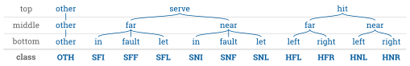
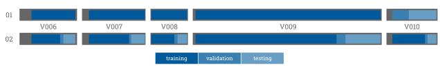
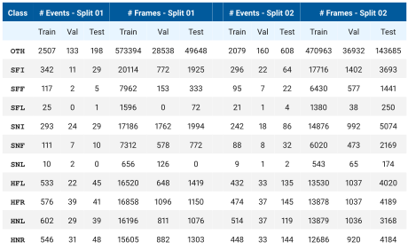
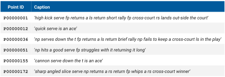
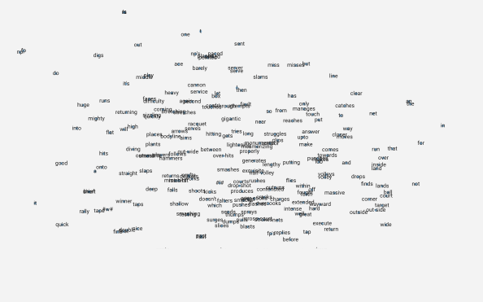

<h1 align="center">Tennis</h1>

A Tennis dataset and models for event detection & commentary generation. Discussed in:

<a href="http://hf.id.au/papers/DICTA17_Tennis.pdf">"TenniSet: A Dataset for Dense Fine-Grained Event Recognition, Localisation and Description"</a>

<b>NOTE: </b>The results in the paper were with old <a href="https://keras.io/">Keras</a> models, new results are
with <a href="https://mxnet.apache.org/">MXNet and Gluon</a> models.

<h2 align='center'></h2>
<h2 align='center'>The Dataset</h2>

The tennis dataset consists of 5 matches and has manually annotated temporal events and commentary 
captions.

Individual shots (serve and hit) are used to generate 11 temporal event categories:

More about the sample numbers for these individual classes can be seen below in the split information.

.......

<h3 align='center'>The Annotator</h3>

The <a href="https://github.com/HaydenFaulkner/TemporalEventAnnotator">annotator</a> was used to annotate the videos with
dense temporal events. 

.......

<h3 align='center'>Data Downloading and Pre-processing</h3>

See <a href="data">data</a> for download and organisation information.

Once you have JSON annotation files from the annotator, you can run: <a href="utils/annotations/preprocess.py"><code>utils/annotations/preprocess.py</code></a> to perform pre-processing on the annotations. <b>Alternatively</b> you can download our annotations .tar.gz (<a href="data">see data</a>)

.......

<h3 align='center'>The Splits</h3>

Due to the limited size of the dataset, there are two varieties of train, validation and testing splits. The first (01) uses the the entire V010 as the validation and test while the second (02) splits across all videos evenly.

The resulting statistics per event class are as follows:

.......

<h3 align='center'>The Captions</h3>

There is one commentary style caption for each of the 746 points, as well as another 10817 captions not aligned to any imagery. Some examples are:

Both groups of captions are utilised to generate a word embedding for the 250 unique words in the vocabulary. The embedding is generated with <a href="train_embeddings.py"><code>train_embeddings.py</code></a> utilising a <a href="https://papers.nips.cc/paper/5021-distributed-representations-of-words-and-phrases-and-their-compositionality.pdf">SkipGram model</a>. Below the 100 dimensional word embedding is visualised post t-SNE.

<h2 align='center'></h2>
<h2 align='center'>The Models</h2>

There are a number of different models architectures to chose from, more information and download links to pretrained models can be found in the README in the <a href="models">models</a> directory.

.......

<h3 align='center'>Event Detection</h3>

These models are trained with <a href="train.py"><code>train.py</code></a>

TODO add table of models and their results

TODO add test and visualisation script

Features can be extracted using <code>--save_feats</code> argument on <a href="train.py"><code>train.py</code></a>, and will save them as .npy in <code>\data\features\$model_id$\</code> with the same structure as <code>\data\frames\</code>.

.......

<h3 align='center'>Captioning</h3>

<b>NOTE: </b>The captioning scripts require the <a href="https://github.com/Maluuba/nlg-eval">nlg-eval</a> package. Please install prior as recommended by thier README

These models are trained with <a href="train_gnmt.py"><code>train_gnmt.py</code></a>

TODO add table of models and their results

TODO add test and visualisation script

