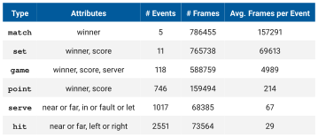

<h1 align="center">Tennis</h1>
<p align="center">
A Tennis dataset and models for event detection & commentary generation. Discussed in:</p>
<p align="center"><a href="http://hf.id.au/papers/DICTA17_Tennis.pdf">"TenniSet: A Dataset for Dense Fine-Grained Event Recognition, Localisation and Description"</a>
</p>


<p align="center"><b>NOTE: </b>The results in the paper were with old <a href="https://keras.io/">Keras</a> models, new results are
with <a href="https://mxnet.apache.org/">MXNet and Gluon</a> models.</p>


<h2 align='center'></h2>
<h2 align='center'>Dataset</h2>

<p align="center">The tennis dataset consists of 5 matches and has manually annotated temporal events and commentary 
captions.</p>
<p align="center"></p>


<p align="center">Individual shots (serve and hit) are used to generate 11 temporal event categories:</p>
<p align="center"></p>

<p align="center">More about the sample numbers for these individual classes can be seen below in the split information.</p>


<h3 align='center'></h3>
<h3 align='center'>The Annotator</h3>
<p align="center">The <a href="https://github.com/HaydenFaulkner/TemporalEventAnnotator">annotator</a> was used to annotate the videos with
dense temporal events. 

<h3 align='center'></h3>
<h3 align='center'>Data Downloading and Pre-processing</h3>
<p align="center">See <a href="data">data</a> for download and organisation information.</p>

<p align="center">Once you have JSON annotation files with the annotator, you can run: <code>python utils/annotations/preprocess.py</code></p>

<p align="center">This does pre-processing on the annotations, specifically:</p>
<p align="center">1. Generates slice .txt files for each .json annotation file</p>
<p align="center">2. Generalises the .json annotation files from player names and forehand/backhand to near/far and left/right</p>
<p align="center">3. Generates label .txt files for each generalised .json annotation file</p>
<p></p>

<p align="center">Alternatively you can download our annotations .tar.gz - <a href="data">see data</a></p>

<h3 align='center'></h3>
<h3 align='center'>The Splits</h3>
<p align="center">Due to the limited size of the dataset, there are two varieties of train, validation and testing splits. The first (01) uses the the entire V010 as the validation and test while the second (02) splits across all videos evenly.</p>
<p align="center"></p>

<p align="center">The resulting statistics per event class are as follows:</p>
<p align="center"></p>

<h2 align='center'></h2>
<h2 align='center'>The Models</h2>
<p align="center">Coming Soon - More information on the models can be found in the README in the models directory.</p>

### Feature extraction
After you have trained a model you can save the backbone output as `.npy` features by using `--save_feats`
```
--model_id 0006 --backbone DenseNet121 --num_gpus 1 --num_workers 16 --save_feats
```
Features will be saved in `\data\features\$model_id$\` with the same structure as `\data\frames\`.

### Evalutations
...

### Visualisations
...

### Captioning
Requires the [nlg-eval](https://github.com/Maluuba/nlg-eval) package. Install this first as per instructions on their 
[Github](https://github.com/Maluuba/nlg-eval).