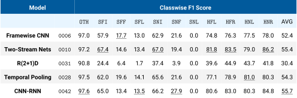
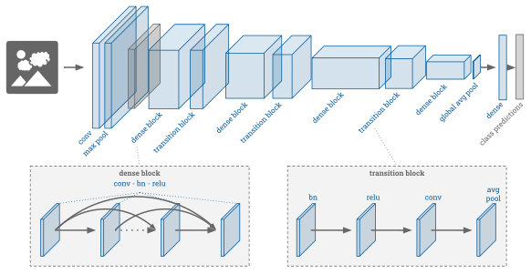
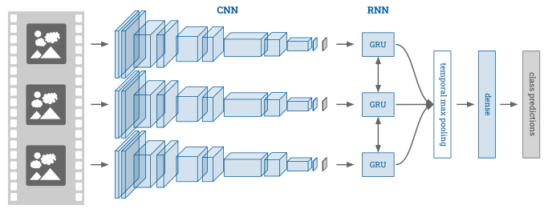
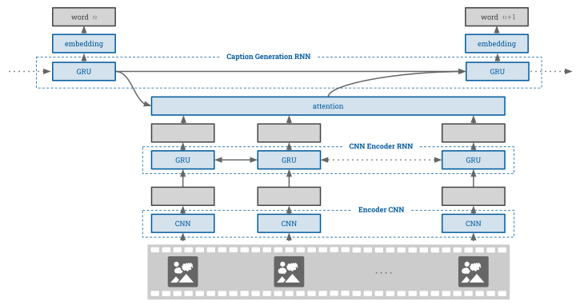
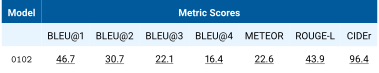

<h1 align="center">Models</h1>
<p align="center">A selection of the best models are available for <a href="https://drive.google.com/open?id=1vODBn10jtQ_MEpxdKXLlG6h0j0JchTBD">download from my Google Drive</a>. After downloading simply store the pre-trained model directories in either the <a href="vision/experiments"><code>vision/experiments</code></a> or <a href="captioning/experiments"><code>captioning/experiments</code></a> directory.</p>
<p align="center">A summary of the models and their results is below</p>
<p align="center"></p>


<h2></h2>
<h2 align="center">Vision</h2>
<h3 align="center">Framewise CNN</h3>
<p align="center">The first model (with ID <code>0006</code>) and basis for many other experiments was a framewise <a href="https://arxiv.org/pdf/1608.06993.pdf">DenseNet-121</a> architecture, this can be evaluated with</p>


```bash
python evaluate.py --model_id 0006 --backbone DenseNet121
```

<p align="center"></p>


<p align="center">.......</p>
<h3 align="center">Two Stream</h3>
<p align="center">The two-stream model (with ID <code>0010</code>) utilises two <a href="https://arxiv.org/pdf/1608.06993.pdf">DenseNet-121</a> CNNs, one for flow and one for RGB. The model can be evaluated with</p>

```bash
python evaluate.py --model_id 0010 --backbone DenseNet121 --flow twos
```

<p align="center">.......</p>
<h3 align="center">R(2+1)D</h3>
<p align="center">The 3D CNN (with ID <code>0031</code>) utilises the a <a href="https://arxiv.org/pdf/1711.11248.pdf">R(2+1)D</a> architecture and can be evaluated with</p>

```bash
python evaluate.py --model_id 0031 --backbone rdnet --window 8 --data_shape 224
```

<p align="center">The CNN is fine-tuned from pre-training on <a href="https://deepmind.com/research/open-source/kinetics">Kinetics</a> and only uses input images of 224 by 224 due to memory constraints</p>


<p align="center">.......</p>
<h3 align="center">Temporal Pooling</h3>
<p align="center">The temporal pooling model (with ID <code>0028</code>) utilises the pretrained framewise <a href="https://arxiv.org/pdf/1608.06993.pdf">DenseNet-121</a> architecture (<code>0006</code>), and uses temporal <b>max</b> pooling. It can be evaluated with</p>

```bash
python evaluate.py --model_id 0028 --backbone DenseNet121 --temp_pool mean --window 15 --backbone_from_id 0006 --feats_model 0006
```

<p align="center"> by specifying <code>--feats_model 0006</code> the model is expecting to read pre-extracted features from <code>\data\features\$model_id$\</code>. These features can be extracted by running something like the following</p>

```bash
python evaluate.py --model_id 0006 --backbone DenseNet121 --save_feats
```

<p align="center">.......</p>
<h3 align="center">CNN - RNN</h3>
<p align="center">The CNN-RNN model (with ID <code>0042</code>) utilises the pretrained framewise <a href="https://arxiv.org/pdf/1608.06993.pdf">DenseNet-121</a> architecture (<code>0006</code>), this can be evaluated with</p>

```bash
python evaluate.py --model_id 0042 --backbone DenseNet121 --temp_pool gru --window 30 --backbone_from_id 0006 --feats_model 0006 --freeze_backbone
```

<p align="center"></p>

<h2></h2>
<h2 align="center">Captioning</h2>
<p align="center">The CNN-RNN captioning model (with ID <code>0102</code>) utilises the pretrained framewise <a href="https://arxiv.org/pdf/1608.06993.pdf">DenseNet-121</a> architecture (<code>0006</code>), and expects the features to be pre-extracted (see Temporal Pooling above). This can be evaluated with</p>

```bash
python evaluate_gnmt.py --model_id 0102 --num_hidden 256 --backbone_from_id 0006 --feats_model 0006
```

<p align="center"></p>

<p align="center"><b>NOTE: </b>The captioning scripts require the <a href="https://github.com/Maluuba/nlg-eval">nlg-eval</a> package. Please install prior as recommended by thier README</p>

<p align="center"></p>